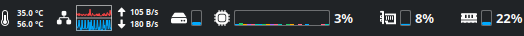
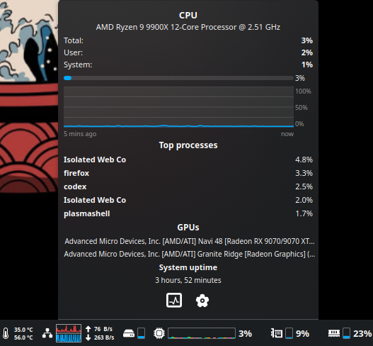
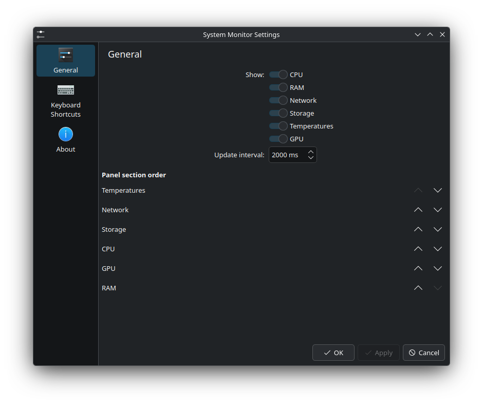

# System Monitor

A panel-friendly system monitor widget for KDE Plasma 6. It shows live CPU, GPU,
memory, network, storage and temperature information in a compact panel view,
with expanded details for deeper inspection.

## Screenshots



*Compact panel layout with the enabled monitor sections.*



*Expanded popup with detailed metrics, graphs and process summaries.*


*Configuration page for section visibility, order and update behavior.*

## Features

- Compact panel sections for CPU, GPU, RAM, network, storage and temperatures.
- Expanded detail views with graphs, usage bars and top process summaries.
- Configurable section visibility and order.
- CPU usage, per-core usage, clock and top CPU processes.
- RAM and swap usage, cache information and top memory processes.
- Network upload/download rates.
- Storage usage and disk read/write rates.
- GPU usage, clock, temperature, memory and GPU process information when available.
- Temperature data from `lm-sensors`.

## Requirements

- KDE Plasma 6.
- Optional: `lm-sensors` for temperature readings.
- Optional: NVIDIA driver tools or supported kernel/sysfs interfaces for GPU
  details, depending on the GPU vendor and driver.

## Install

From the repository root:

```sh
./install.sh
```

Then add the widget to your panel:

1. Right-click the Plasma panel.
2. Select **Add Widgets**.
3. Search for **System Monitor**.
4. Drag it onto the panel.

If the widget is already installed, the script updates it in place.

## Update

After pulling new changes, run:

```sh
./install.sh
```

If Plasma keeps showing an older copy, restart Plasma Shell:

```sh
./install.sh --restart-plasma
```

## Remove

```sh
./install.sh --remove
```

## Manual Installation

You can also install the package by copying it into Plasma's local plasmoid
directory:

```sh
mkdir -p ~/.local/share/plasma/plasmoids/com.labatata.sysmonitor
cp -a package/. ~/.local/share/plasma/plasmoids/com.labatata.sysmonitor/
```

To update an existing installation, replace the installed directory:

```sh
rm -rf ~/.local/share/plasma/plasmoids/com.labatata.sysmonitor
mkdir -p ~/.local/share/plasma/plasmoids/com.labatata.sysmonitor
cp -a package/. ~/.local/share/plasma/plasmoids/com.labatata.sysmonitor/
```

To remove it:

```sh
rm -rf ~/.local/share/plasma/plasmoids/com.labatata.sysmonitor
```

## Acknowledgements
The icons used in this project were borrowed from [astra-monitor](https://github.com/AstraExt/astra-monitor).